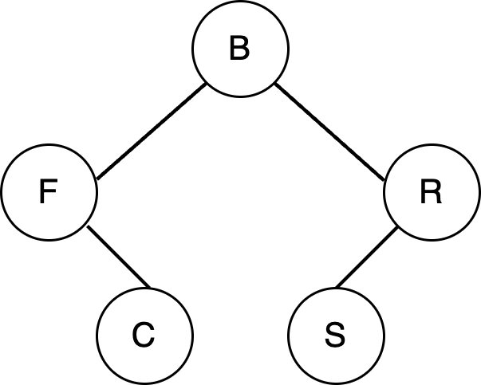
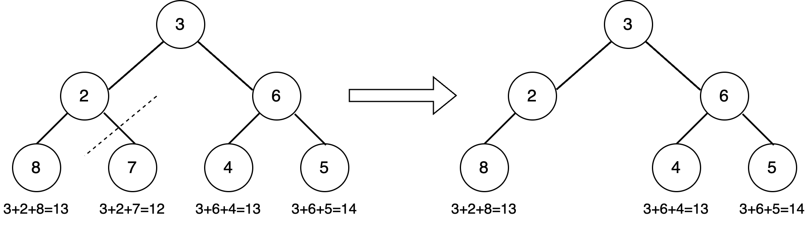
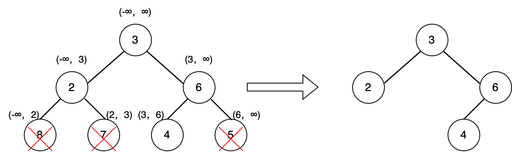

# HW11: Binary Tree

Deadline: 04/11/2025

Late Due Date: 04/16/2025

## Goals
- Understand tree structure implementation using pointers and dynamic memory allocation.
- Master recursive algorithms for tree traversal and manipulation.
- Develop problem-solving skills.

## Background

In computer science, a [binary tree](https://en.wikipedia.org/wiki/Binary_tree) is a tree data structure in which each node has at most two children, referred to as the left child and the right child.

### Tree Node

Binary trees are constructed by tree nodes. A tree node contains some data and references to its left child and its right child. Here is a basic implementation of a TreeNode class.
```
typedef struct TreeNode {
    int data;
    struct TreeNode* left;
    struct TreeNode* right;
} TreeNode;
```

### Tree Traversal
[Tree traversals](https://en.wikipedia.org/wiki/Tree_traversal) are ways of visiting the nodes of a tree data structure in a certain order. 

1. ***Pre-order Traversal***: we always visit the current node; next, we recursively traverse the current node's left subtree, and then we recursively traverse the current node's right subtree. 

2. ***In-order Traversal***: we always recursively traverse the current node's left subtree; next, we visit the current node, and lastly, we recursively traverse the current node's right subtree.

3. ***Post-order Traversal***: we always recursively traverse the current node's left subtree; next, we recursively traverse the current node's right subtree and then visit the current node. 

4. ***Level-order Traversal***: also known as ***Breadth-first Traversal***. We visit nodes level by level from top to bottom, left to right within each level. 




For example, given the tree above, the traversal orders are as follows:  

- **Pre-order:** B, F, C, R, S  
- **In-order:** F, C, B, S, R  
- **Post-order:** C, F, S, R, B  
- **Level-order:** B, F, R, C, S


Implementing tree traversal algorithms in this homework is a warm-up to help you get comfortable with tree structures and recursion.

For this homework, you'll create and modify a tree. Since it's hard to verify if your tree is built correctly, ***we ask you to print both the Pre-order and In-order traversals of your tree***. <u>These two traversals together uniquely identify a binary tree, making it easy to check your work.</u>

## Construct a Binary Tree

A binary tree can be stored in an array by mapping tree nodes to array indices in a **level-order** traversal. The root node is stored at index 0. If a node has an index i, its children are found at indices `2*i+1` (for the left child) and `2*i+2` (for the right child). Here is an example:


You will be implementing the function `TreeNode* createTree(int* arr, int size)` which constructs a binary tree from the above array representation and returns a pointer to the root node.

### Parameters

- `int* arr`: A pointer to an array of integers representing the values to be stored in the binary tree. In this implementation, all integers are non-negative, and `-1` is used as a placeholder to represent `NULL` values (i.e., missing nodes). 
- `int size`: The number of elements in the array.

### Return Value

- A pointer to the root node of the created binary tree.


## Trim a Binary Tree Based on Path Sum

Given a binary tree where each node contains a non-negative integer and two integers, `low` and `high`, your task is to trim the tree such that every root-to-leaf path in the resulting tree has a sum within the inclusive range [low, high]. 

Specifically, any *leaf* node whose path sum from the root to that leaf falls outside this range should be removed from the tree. If removing a leaf node causes its parent to become a leaf and its new path sum also falls outside the valid range, that parent should be removed as well. This process should continue recursively until all remaining root-to-leaf paths satisfy the constraint.

The structure of the remaining nodes must be preserved, and the final tree must still be a valid binary tree. Your function should return the root of the trimmed tree.

Here is an example with `low = 13` and `high = 14`:



### Parameters

- `TreeNode* root` – A pointer to the root of the input binary tree.

- `int low` – The lower bound (inclusive) for valid root-to-leaf path sums.

- `int high` – The upper bound (inclusive) for valid root-to-leaf path sums.

### Return Value

- A pointer to the root of the trimmed tree. If all nodes are removed, returns `NULL`.


## Prune a Binary Tree to BST

Given a binary tree, you are asked to transform it into a valid Binary Search Tree (BST) by pruning subtrees that violate BST properties. The transformation must ensure that for every node:

- All nodes in the left subtree have values less than the current node.

- All nodes in the right subtree have values greater than the current node.

**Restrictions**: The root node must remain unchanged. 
If a node's value violates BST properties relative to all its ancestors, its entire subtree is removed.




This example illustrates the process. Each node has a range constraint (min, max), which defines the valid range of values. The root node doesn’t have any constraint.

For node 2, it is the left child of the root node, so its valid range is ($-\infty$, 3).

For node 8, it is the left child of node 2, meaning its valid range is 
($-\infty$, 2). However, 8 is greater than 2, violating the BST property, so it is removed.

For node 7, it is the right child of node 2, so its valid range is (2, 3). Since 7 is greater than 3, it also violates the BST property and is pruned.

For node 6, it is the right child of the root node 3, so its valid range is (3, $\infty$). Since 6 falls within this range, it remains in the tree.

For node 4, it is the left child of node 6, so its valid range is (3, 6). Since 4 falls within this range, it is valid and remains in the tree.

For node 5, it is the right child of node 6, meaning its valid range is (6, $\infty$). However, 5 is less than 6, violating the BST property, so it is removed.

**Note:** In this example, all removed nodes are leaf nodes. If a removed node had children, its entire subtree would also be removed to maintain the BST properties.


### Parameters
- `TreeNode* root` – A pointer to the root of the input binary tree.

### Return Value
- A pointer to the root of the modified tree, which is now a valid BST. 