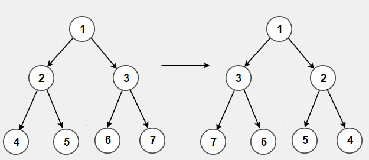

# Inverting Trees

## Objectives

In this assignment, you will implement a complete program to invert a binary tree. You will write the core logic for the inversion, as well as the main function to test and demonstrate your implementation.

## Background

Inverting a binary tree refers to swapping the left and right branches at every node in the binary tree, i.e.:

## Input & Output Files

### Format

Your `main` function should take two command line arguments:
- the input file name
- the output file name

Both files will have the same format, which is specified below.

The files are in binary format, representing the preorder traversal of the tree. Each non-NULL node is represented with an integer and an unsigned char. The integer is the key stored in the node, while the unsigned char holds structural information.

If a node has a left child, the twos place of the unsigned char is 1. If it has a right child, the ones place of the unsigned char is a 1. Therefore, if a node has two children, its structural byte will hold the value `00000011`. If it has only a left child, it will hold `00000010`. In the text files, a numerical value of 3 corresponds to two children, 1 to a right child only, and 2 to a left child only.

### File Contents

The input file contains the preorder representation of the initial tree, with structural information in the given format.

The output file will contain the preorder representation of the inverted tree, with structural information as specified above.

## Testing

We have provided a Makefile for you to compile and run your code. There are example test cases provided, but they are not comprehensive -- we expect you to write your own (more extensive) test cases to be well-prepared.

To this aim, you may find functions that convert between text files and binary files particularly useful.

## Submission

You will submit two files -- `main.c` and `tree.c` -- that fulfil the specification given above.
