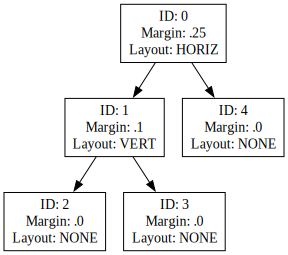
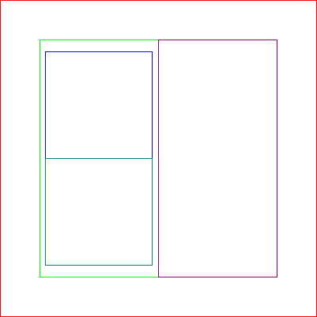

[](https://classroom.github.com/a/GtadUl-p)
# Layout Engine

## Learning Goals

In this assignment, you will build a _layout engine_: a program that uses a heirarchical description of a document (for example, a bunch of HTML elements and their relationships to each other) to determine the positions and sizes of each element.

## Document Tree

The heirarchical structure of a document makes it easy to encode in a tree:

- Each element in the document corresponds to a node in the tree
- Subtrees represent the "children" of an element (i.e. the elements contained within it)

### Structure of an Element

A node in a document tree additionally contains some information about style. In the real world, this might include things like the element shape, margins/paddings, minimum/maximum element sizes, alignments and relative positions, etc., but in our simplified engine, a node will contain the following information:

- A unique integer `id` representing the element
- A (linked) list of child elements
- A `layout_direction` determining how its children are placed, which is one of:

  - `LAYOUT_HORIZ` if they are stacked horizontally,
  - `LAYOUT_VERT` if they are stacked vertically, or
  - `LAYOUT_NONE` if they are placed directly on top of each other (i.e., occupying the same space)
> Note that the `layout_direction` of a node with no children can be ignored.

- A `margin`, expressed as a value between $0$ and $1$, representing how much of the parent's width and height should go unused.

We will additionally make the following assumptions:

- Each element is rectangular
- All the children of a given parent have the same size
- The left/right and top/bottom margins are always the same _relative to the size of the parent_ (the examples below might help clarify this)

The layout of a tree will be computed in some _window_ with a given width and height; the size of the root element of the tree should match the size of the window.

The definitions of the node (`struct DOMNode`) and the linked list of nodes (`struct DOMNodeList`) can be found in `hw14.h`

### Example

Consider rendering the following document tree in a $160\times 160$ window:



The result is:



The red box represents node $0$, and takes up the full $160\times 160$ pixels.
Since it specifies a $25$ % margin, the total horizontal margin is $0.25\times 160 = 40$, split into $20$ px on the left and $20$ px on the right, and similarly $20$ px on the top and $20$ px on the bottom.

Its children, nodes $1$ (in green) and $4$ (in purple), are laid out horizontally next to each other.
Since the remaining width is $160 - 40 = 120$, each child has a width of $60$ px and a height of $120$.

Node $1$ has a $10$ % margin, which corresponds to $3$ px left/right and $6$ px top/bottom, leaving a width of $54$ px and a height of $108$ px for its children.

The children, nodes $2$ (blue) and $3$ (teal), are laid out vertically, so they each have a size of $54\times 54$.

### Input/Output Format

#### Document Tree

The document trees are serialized to text files in the following format:

```
([id] [horiz|vert|none] [margin] [child1] ... [childN])
```

For example, the tree pictured above is serialized as:

```
(0 horiz 0.25 (1 vert .1 (2 none 0) (3 none 0)) (4 none 0))
```

The starter code provided to you includes a `load_tree` function that parses and builds a tree following the above format.

#### Layout Information

The computed layout should be saved to a text file with the following format:

The first line contains two numbers representing the width and height (respectively) of the window.
Each subsequent line represents the layout of one element and has the format:

```
[id] [left] [top] [right] [bottom]
```

Each pixel value (i.e., the left/top/right/bottom coordinates, as well as the window width/height) should be printed as floating points with two decimal places of precision.
The element IDs should be printed as integers.

Except for the width/height line needing to appear at the top, the order of the subsequent lines does not matter.

### Rendering a layout

Manually reading the layout text files can be challenging.
The provided Makefile includes a `render` target which builds a command-line utility that renders a computed layout to a bitmap image.
Once the utility is built, it can be invoked as follows:

```
./render [color map file] [layout file] [output image name]
```

where

- The color map file specifies the colors to use for each element (a default one is provided in `colors.txt`, but feel free to experiment with these)
- The layout file is the text file generated by your program
- The output image filename should end with `.bmp`, and will be created by the utility

An example invocation is as follows (where the `$` represents your terminal prompt, and should not be typed in):

```
$ make layout
$ ./layout tests/1 1.out 160 160
$ make render
$ ./render colors.txt 1.out 1.bmp
```

## Submission Instructions

Submit the `hw14.c` file after filling out the following functions:

- `void layout(struct DOMNode *root, float width, float height, FILE *target)` where
  - `root` is a pointer to the root of the document tree
  - `width` and `height` are the width/height of the window
  - `target` is a pointer to the file handle of the output layout file
- `void free_DOMTree(struct DOMNode *root)` where
  - `root` is a pointer to the root of the document tree being freed
