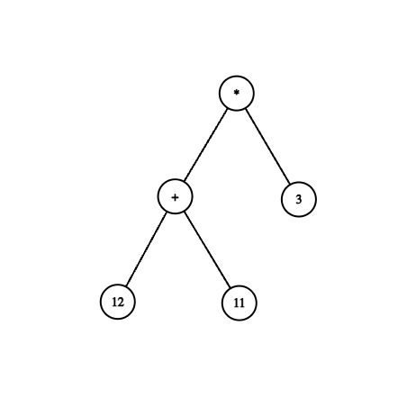

[](https://classroom.github.com/a/iXGODVt7)
# Interpreter

## Learning Goals

> NOTE: This assignment builds on HW 8, so make sure you do that first!

The goal of this assignment is to build a simple calculator for arithmetic expressions.
You will do this in three steps:

1. Extend your expression parser from HW 8 to build a _parse tree_ instead of just indicating success or failure
2. Transform the parse tree into an _abstract syntax tree_ (AST)
3. Implement an _interpreter_ that walks the AST to evaluate the parsed expression

## Changes from HW 8

### Grammar

There are a few minor changes to the grammar, tokenizer, etc. from HW 8.
The new grammar is as follows:

```
expr := term expr_rest
expr_rest := '+ expr | {}

term := factor term_rest
term_rest := '*' term | {}

factor := int | '(' expr ')' | '-' factor
```

In particular, note that `-` is now a unary negation operator rather than a binary subtraction operator.

This is because the grammar is right-associative, so an expression like `1 - 2 - 3` would be parsed as `1 - (2 - 3)` which evaluates to $2$ instead of $-4$ as we would expect.
By making the only binary operators `+` and `*` which are associative anyways, we avoid this confusion: the first expression can now be written `1 + -2 + -3`, and the second expression `1 + -(2 + -3)` to disambiguate.

### Tokenizer

The tokenizer has been updated to be slightly more friendly as well.
Instead of `+`, `*`, and `-` all being `TOK_BINOP` tokens, there are now separate token types for `TOK_ADD`, `TOK_MUL`, and `TOK_NEG`.
Thus there is no longer a need to check `tok.start[0]` to figure out what operator you peeked :)

## Syntax Trees

### CST

The parser you built in HW 8 only reports success or failure, but doesn't give us any way to reason about the actual expression we successfully parsed.
However, notice that given a recursive descent parser, the _actual sequence of steps the parser takes_ very closely follow the structure of the expression!
We can record the steps the parser takes in a tree called a _parse tree_ (also called a _Concrete Syntax Tree_, or CST) as follows:

- Each node of the tree is labeled by a production rule or variant the parser took
- The children of a node describe the parse trees for the sequence of nonterminals associated with that rule

For example, the expression

```
(11 + 12) * 3
```

yields the parse tree:


### AST

The concrete syntax tree we get back after parsing an expression is often pretty large, and has a bunch of uninteresting nodes (like empty `expr_rest()`s, etc.)
To actually evaluate our expression, we want to represent this as something that more closely matches the _abstract structure_ of the evaluation.
So instead of individual nodes representing `expr`, `expr_rest`, ... we want nodes that represent addition, multiplication, etc.

This simplfied tree is called an _abstract syntax tree_ (AST).
The AST corresponding to the expression above is:



## Building The Trees

### CST

It turns out to be pretty easy to modify our parser to return the actual parse tree instead of just success or failure.
We need to make three changes:

- Each `parse_...` function now returns a `struct CST_node *` instead of an `enum parse_result`
- For each nonterminal, instead of checking whether the recursive call returned `PARSE_SUCCESS`, we check whether it returned a _non-null parse tree_
- On a successful parse, instead of returning `PARSE_SUCCESS`, we build and return an actual `struct CST_node *` corresponding to the production being parsed, and assign its children based on the successful recursive calls we made

#### Structure

The header file `cst.h` provides a definition of `struct CST_node` for you to use.
Each node has a `type` field which encodes the production rule that node represents (e.g. `NODE_EXPR`, `NODE_EXPR_REST`, etc.).
The struct also has a `union` of several anonymous `struct`s: the `union` means that only one of the `struct`s should be assigned to at a time (in particular, the one corresponding to the provided `type`).
This is not something C enforces, so you need to enforce it yourself in your code!

For instance, if you have a `struct CST_node *n` where `n->type == NODE_EXPR`, its okay to access `n->expr.term` and `n->expr.expr_rest`, but not `n->factor.negated`.

Something to be careful with is how you represent the empty variants of `expr_rest` and `term_rest`.
You don't just want to represent them as null `CST_node *`s, since we use `NULL` to indicate parse failure.
We recommend representing an empty `expr_rest`, for example, as a _non-null `expr_rest` node with a `NULL` `expr_rest.expr` field_`.

### AST

Once we've built a parse tree, we can traverse it recursively and turn groups of concrete nodes into their corresponding abstract nodes.
For instance, given an `expr` node, we can check whether its `expr_rest` child is empty. If it is, we can just return the AST corresponding to the `expr`'s `term` child. If its not, we recursively visit the `expr` child of the nonempty `expr_rest` child.

Think about how to write this traversal!

## Interpreter

An _interpreter_ is a program that takes as input some representation of another program, and executes it.
The kind of interpreter you will write in this assignment is called a _tree-walking interpreter_, since it directly executes the AST of some expression.

Think about what kind of tree traversal you need to perform to evaluate an AST into an integer!

## Submission Instructions

You will need to implement the following functions:

- In `parse_cst.c`:
  - All the `parse_...`
  - `free_cst`
- In `ast.c`:
  - `to_ast`
  - `free_ast`
  - `interpret`

Submit `ast.c` and `parse_cst.c`

The `main.c` file has a couple of provided functions that can pretty-print a CST or an AST to stdout, which you may find useful for debugging.
